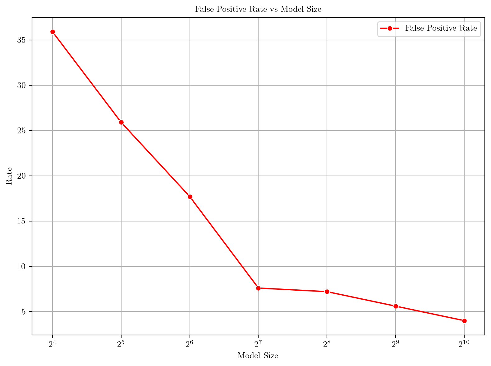

# Neural Bloom Filter

> A neural-enhanced probabilistic data structure for efficient set membership testing with improved memory utilization.


---

## 📚 Table of Contents

- [Introduction](#introduction)
- [Project Overview](#project-overview)
- [Model Architecture](#model-architecture)
- [Implementation Details](#implementation-details)
- [Results](#results)
- [Getting Started](#getting-started)
- [Requirements](#requirements)
- [Usage](#usage)
- [Contributors](#contributors)

---

## 🧠 Introduction

**Bloom filters** are space-efficient probabilistic data structures used for set membership tests. While traditional Bloom filters use static hash functions, our project introduces a neural network-based extension, **Neural Bloom Filters (NBFs)**, that learns from data distributions and adapts memory usage for efficient performance.

---

## 🔍 Project Overview

The **Neural Bloom Filter** replaces handcrafted hash functions with a learned neural encoder and an addressable memory structure. By training end-to-end, NBFs enable:

- Adaptive memory updates
- Data-distribution-aware storage
- Reduced false positive rates under tight memory constraints

We experiment on the **MNIST dataset**, evaluating the filter's ability to remember and retrieve digit set membership.

---

## 🏗️ Model Architecture

The NBF comprises three core modules:

1. **Encoder**: A CNN that converts images to feature embeddings
2. **Controller**: Produces address (`a`) and write (`w`) vectors
3. **Memory Matrix (`M`)**: Stores set members via soft addressing

### ✍️ Write Operation


1. Encode input `x` → `z`
2. Compute `a` (address vector) and `w` (write vector)
3. Update memory: `M = M + outer(w, softmax(a))`

### 🔎 Read Operation


1. Encode query image → `z`
2. Compute `a` → read vector `r = M @ softmax(a)`
3. Combine `r`, `z`, and `w` for final prediction

---

## 🛠️ Implementation Details

Implemented in **PyTorch**, key components include:

- `SimpleEncoder`: CNN that encodes 28×28 images to 128D vectors
- `NeuralBloomFilter`: Manages write/read and predictions
- **Meta-Learning Setup**: Trains on episodic tasks with varied digit subsets

### 🔁 Training Details

- Loss: Binary Cross Entropy
- Optimizer: Adam
- Tasks: Episodic few-shot batches
- Memory: Tunable size (affects accuracy vs memory trade-off)

🔗 **Code Repository**: [github.com/Zeenu03/CS-328-Neural-Bloom-Filter](https://github.com/Zeenu03/CS-328-Neural-Bloom-Filter)

---

## 📊 Results

We analyze **false positive and false negative rates** under varying memory sizes.

### ✅ False Positive Rate vs Model Size



NBFs consistently achieve lower FPRs for the same memory compared to classical Bloom filters.

### ❌ False Negative Rate vs Model Size


While traditional BFs guarantee zero FNR, NBFs introduce some due to neural approximation. FNR decreases with memory size.

### 💾 Memory Efficiency Comparison


NBFs outperform classical BFs in memory consumption at similar FPRs, especially in low-error regimes.

---

## 🚀 Getting Started

Clone the repository:

```bash
git clone https://github.com/Zeenu03/CS-328-Neural-Bloom-Filter.git
cd CS-328-Neural-Bloom-Filter
```

---

## 📦 Requirements

```bash
pip install torch torchvision tensorflow numpy matplotlib seaborn mmh3 bitarray
```

---

## 👥 Contributors

- **Bhavik Patel**
- **Jinil Patel**
- **Pranav Patil**

---

### 📎 Related Work

This work is inspired by "Meta-Learning Neural Bloom Filters" and explores their extension to image domains using learned memory modules.

---

### 📬 Contact

For queries, feel free to raise an issue or email any of the contributors.
